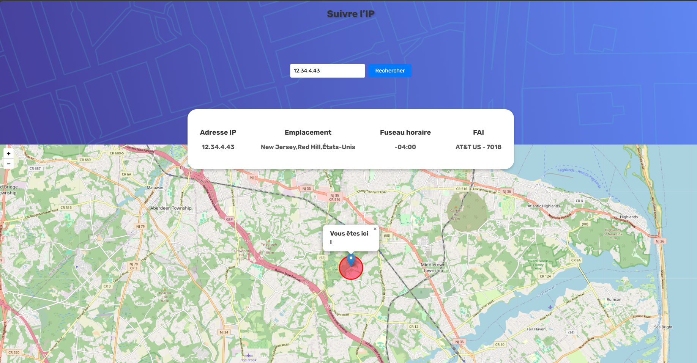

# Track  IP  🌐
 

## Overview

Track IP est une petite application Web qui permet aux utilisateurs de suivre l’emplacement géographique d’une adresse IP donnée. L’application fournit des informations telles que l’adresse IP, l’emplacement (y compris la ville, la région et le pays), le fuseau horaire et le fournisseur d’accès Internet (FAI). De plus, l’emplacement est affiché sur une carte interactive à l’aide de Leaflet.js.

